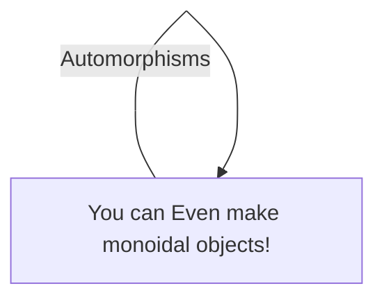

# Documentation matters
Communication is an important part of making anything. I generally find that documents that
aren't attached to the codebase are easily lost. I also generally dislike some of the
format restrictions that are imposed by common tools used in corporate environments such as
the microsoft office suite. Basic digital features such as hypertext, hiararchical navigation,
and integration with version control systems are important features for communicating effectivly about
a rapidly changing and complicated subject such as an ongoing software project.


# mdbook
mdbook is a tool for turning markdown files in to webpages, PDFs, and other finished products.

```shell script
cargo install mdbook
```

## mdbook hints
mdbook will automatically create blank markdown files from the `SUMMARY.md`, which is an easy way to keep
the summary in sync with your files as you grow. 

# mermaid.js
[mermaid.js](https://mermaid-js.github.io/mermaid/#/) can be [integrated with mdbook](https://github.com/badboy/mdbook-mermaid) as a preproccessor.
It produces a variety of useful diagrams such as these:




[mermaid cheatsheet](https://jojozhuang.github.io/tutorial/mermaid-cheat-sheet/) is a good
resource for mermaid syntax

## setting up mermaid.js
Install mdbook-mermaid with
```shell script
cargo install mdbook-mermaid
```

your book.toml needs to have the following lines to invoke the mermaid preprocessor
```shell script
[preprocessor.mermaid]
command = "mdbook-mermaid"

[output.html]
additional-js = ["mermaid.min.js", "mermaid-init.js"]
``` 

These config lines and associated files can be automatically added with
```shell script
mdbook-mermaid install path/to/your/book
```


# wavedrome

A live wavedrome editor is provided [here](https://wavedrom.com/editor.html).

# instalation and setup
