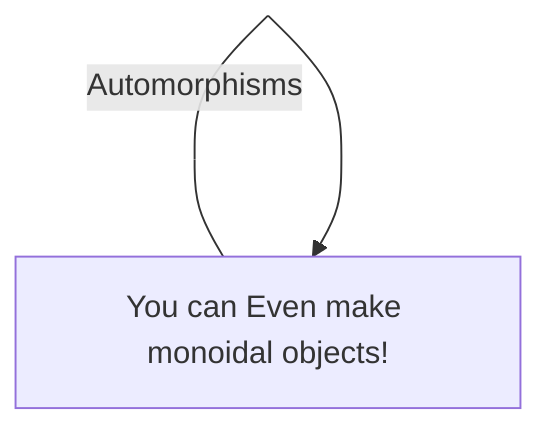

# Documentation Matters
Communication is an important part of making anything. I generally find that documents that
aren't attached to the codebase are easily lost. I also generally dislike some of the
format restrictions that are imposed by common tools used in corporate environments such as
the microsoft office suite. Basic digital features such as hypertext, hiararchical navigation,
and integration with version control systems are important features for communicating effectivly about
a rapidly changing and complicated subject such as an ongoing software project.

# mdbook
This page was created with [mdbook][], which is a tool for turning markdown files into webpages, 
PDFs, and other finished products. This is well suited to co-existing with code or other version controlled
artifacts, and can be readily integrated with [continuous integration] systems and deployed to hosting
services like github/gitlab pages.

[mdbook]: https://github.com/rust-lang/mdBook
[continuous integration]: https://rust-lang.github.io/mdBook/continuous-integration.html

Install with: 
```shell script
cargo install mdbook
```

# mermaid.js
[mermaid.js](https://mermaid-js.github.io/mermaid/#/) can be [integrated with mdbook](https://github.com/badboy/mdbook-mermaid) as a preproccessor.
It produces a variety of useful diagrams such as these:




The [mermaid cheatsheet](https://jojozhuang.github.io/tutorial/mermaid-cheat-sheet/) is a good
resource for mermaid syntax.

Install mdbook-mermaid with:
```shell script
cargo install mdbook-mermaid
mdbook-mermaid install path/to/your/book
```
your book.toml will be update to include the following lines to invoke the mermaid preprocessor.
```shell script
[preprocessor.mermaid]
command = "mdbook-mermaid"

[output.html]
additional-js = ["mermaid.min.js", "mermaid-init.js"]
``` 

# wavedrom
[Wavedrom][] will render digital timing diagrams from JSON descriptions, and is integrated with
 [mdbook-wavedrom][]. A [live wavedrom editor][] is available.

[Wavedrom]: https://wavedrom.com
[mdbook-wavedrom]: https://github.com/JasMoH/mdbook-wavedrom
[live wavedrom editor]: https://wavedrom.com/editor.html
```wavedrom
{signal: [
  {name: 'clk', wave: 'p.....|...'},
  {name: 'dat', wave: 'x.345x|=.x', data: ['head', 'body', 'tail', 'data']},
  {name: 'req', wave: '0.1..0|1.0'},
  {},
  {name: 'ack', wave: '1.....|01.'}
]}
```
wavedrom is installed the same way as mermaid
```shell script
cargo install mdbook-wavedrom
mdbook-wavedrom install path/to/your/book
```